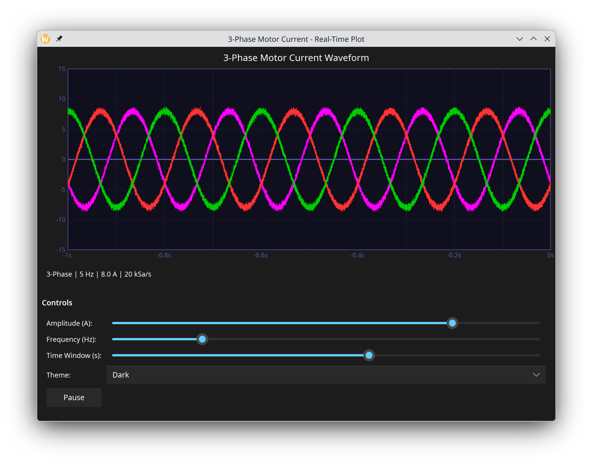

# Real-Time Plotting with Slint + WGPU

A reference implementation of **real-time waveform plotting** in [Slint](https://slint.dev/) using custom **WGPU shaders** — something not covered by existing Slint examples or third-party projects.

The demo simulates a 3-phase AC motor current sensor and renders waveforms entirely on the GPU at 20 kHz sample rate. It runs on desktop (Linux, Windows, macOS) and Android.



## Why This Project

Slint doesn't ship with a real-time plotting widget. If you need to visualize streaming data — sensor readings, audio, telemetry — you have to build the rendering yourself. This project shows one way to do it: bypass Slint's drawing primitives, render the plot as a GPU texture via WGPU, and composite it back into the Slint scene.

Key techniques demonstrated:

- **Slint ↔ WGPU integration** — using `set_rendering_notifier` to hook into Slint's render loop and produce a custom texture each frame
- **WGSL fragment shader for waveforms** — a single fullscreen-triangle pass that reads from a storage buffer and draws anti-aliased, color-coded, multi-channel signals
- **Min/max line rendering** — for each pixel column, the shader computes the min and max sample values across the corresponding time range, then draws a vertical line segment between them — this is how oscilloscopes handle zoomed-out views without aliasing
- **GPU immediates** (`var<immediate>`) — plot parameters (write position, Y-axis range, visible samples, theme) are passed as push constants, avoiding extra buffer allocations
- **Circular buffer on GPU** — 32,768 interleaved samples streamed to a storage buffer every frame with modular index arithmetic in the shader

## The Shader

The core of the project is `src/shader.wgsl`. It implements:

1. **Fullscreen triangle** vertex shader (3 vertices, no vertex buffer)
2. **Per-pixel-column sampling** — maps each column to a range of samples based on zoom level
3. **Min/max envelope** — finds the extremes within each column's sample range
4. **Anti-aliased edges** — `smoothstep` distance from pixel to the [min, max] line segment
5. **Per-channel colors** — Phase 1 (magenta), Phase 2 (red), Phase 3 (green)
6. **Glow effect** — subtle color halo around lines in dark mode

The shader reads samples from a `storage` buffer and all parameters via `immediate` constants — no uniform buffers needed.

## Features

- **20 kHz sample rate**, 32,768-sample circular buffer (3 channels interleaved)
- **Interactive controls** — amplitude (0.1–10 A), frequency (1–20 Hz), time window (0.1–1.6 s)
- **Play/Pause** to freeze the simulation
- **Dark / Light / System theme** with glow effects in dark mode
- **Android support** with safe area insets for notches and system bars

## Building

### Prerequisites

- [Rust](https://rustup.rs/) (edition 2024)
- GPU with Vulkan, Metal, or DX12 support

### Desktop

```bash
cargo run --release
```

### Android

Android builds use [xbuild](https://github.com/rust-mobile/xbuild) as recommended by the [Slint Android docs](https://docs.slint.dev/latest/docs/slint/guide/platforms/mobile/android/).

1. Install prerequisites:

   - [Android Studio](https://developer.android.com/studio) — install the Android SDK via its SDK Manager
   - Add `$ANDROID_HOME/platform-tools` to your `PATH` (for `adb`)
   - Install the Rust Android target and xbuild:

```bash
rustup target add aarch64-linux-android
cargo install --git https://github.com/rust-mobile/xbuild.git
```

2. Set environment variables (adjust paths for your system):

```bash
export ANDROID_HOME="$HOME/Android/Sdk"
export ANDROID_NDK_ROOT="$ANDROID_HOME/ndk/<version>"
```

3. Build and run on a connected device:

```bash
x run --device adb:<device-id> --no-default-features --features android
```

4. Build a release APK for distribution:

```bash
x build --platform android --arch arm64 --format apk --release --no-default-features --features android
```

The output APK will be in `target/x/release/android/`.

## Project Structure

```
src/
  shader.wgsl     # WGSL vertex + fragment shader for waveform rendering
  renderer.rs     # WGPU pipeline setup, texture management, buffer uploads
  data_gen.rs     # 3-phase motor simulator (circular buffer, noise, transients)
  lib.rs          # App init, WGPU device config, render loop, timer
  main.rs         # Desktop entry point
ui/
  scene.slint     # UI layout: plot area, grid overlay, controls, axis labels
```

## Dependencies

| Crate | Purpose |
|-------|---------|
| [slint](https://slint.dev/) (git, `unstable-wgpu-28`) | UI framework with WGPU texture integration |
| [wgpu](https://wgpu.rs/) 28 | Cross-platform GPU API |
| [bytemuck](https://docs.rs/bytemuck) | Safe transmute for GPU data upload |

## License

This project is licensed under the [MIT License](LICENSE).
