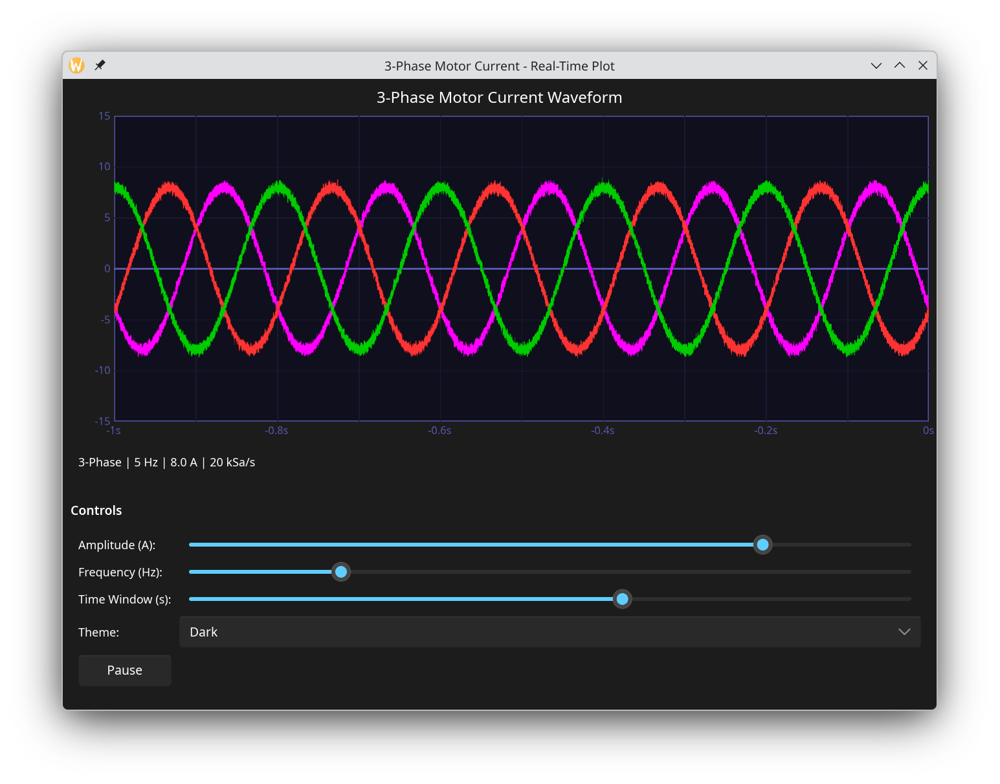

# Real-Time Plotting with Slint + WGPU

A reference implementation of **real-time waveform plotting** in [Slint](https://slint.dev/) using custom **WGPU shaders** — something not covered by existing Slint examples or third-party projects.

The demo simulates a 3-phase AC motor current sensor and renders waveforms entirely on the GPU at 20 kHz sample rate. It runs on desktop (Linux, Windows, macOS) and Android.



## Why This Project

Slint doesn't ship with a real-time plotting widget. If you need to visualize streaming data — sensor readings, audio, telemetry — you have to build the rendering yourself. This project shows one way to do it: bypass Slint's drawing primitives, render the plot as a GPU texture via WGPU, and composite it back into the Slint scene.

Key techniques demonstrated:

- **Slint ↔ WGPU integration** — using `set_rendering_notifier` to hook into Slint's render loop and produce a custom texture each frame
- **WGSL fragment shader for waveforms** — a single fullscreen-triangle pass that reads from a storage buffer and draws anti-aliased, color-coded, multi-channel signals
- **Hybrid line / peak-detect rendering** — zoomed in (≤ 8 samples per logical pixel) the shader connects consecutive samples with anti-aliased line segments; zoomed out it computes the min/max envelope per pixel column and draws vertical bars — this is how oscilloscopes handle zoomed-out views without aliasing
- **GPU immediates** (`var<immediate>`) — plot parameters (write position, Y-axis range, visible samples, view offset, hidpi scale) are passed as push constants, avoiding extra buffer allocations
- **Lock-free SPSC ring buffer** — 32,768 interleaved samples generated on a dedicated thread and shared with the render loop through atomics, no locks
- **Render caching** — a generation counter on the buffer lets the renderer skip the CPU→GPU upload and the render pass entirely when nothing changed (e.g. while paused)

## The Shader

The core of the project is `src/shader.wgsl`. It implements:

1. **Fullscreen triangle** vertex shader (3 vertices, no vertex buffer)
2. **Line mode** — per-pixel distance to the nearest waveform segment, anti-aliased with `smoothstep`, hidpi-aware line width
3. **Peak-detect mode** — min/max envelope per pixel column when many samples map to one pixel
4. **Ring-buffer indexing** — modular arithmetic over `write_pos`, `visible_samples`, and `view_offset` (pan)
5. **Per-channel colors** from a uniform buffer (configured on the Rust side, matches the UI legend)
6. **NaN-transparent** — unwritten buffer slots hold NaN and render as transparent, so a partially filled buffer has no artificial baseline

The shader reads samples from a `storage` buffer and all parameters via `immediate` constants.

## Features

- **20 kHz sample rate**, 32,768-sample lock-free ring buffer (3 channels interleaved), generated on a background thread
- **Interactive controls** — amplitude (0.1–10 A), frequency (1–20 Hz, phase-continuous changes), time window (0.1–1.6 s)
- **Pan & zoom** — scroll wheel and pinch gesture zoom toward the cursor, drag to pan through history while paused, on-plot +/− buttons for touch
- **Pause** via button or double-click, with paused-state border highlight
- **Auto-ranging Y axis** — follows the visible data (expands instantly, shrinks smoothly) and snaps to nice 1-2-5 grid steps
- **Cursor readout** — hover shows a measurement line with per-channel values and the time offset
- **CSV / PNG export** of the visible window
- **Dark / Light / System theme** with glow effects
- **Hidpi-aware** — the texture is rendered at physical resolution, and line widths/mode switching account for the scale factor
- **Android support** with safe area insets for notches and system bars

## Building

### Prerequisites

- [Rust](https://rustup.rs/) (edition 2024)
- GPU with Vulkan, Metal, or DX12 support

### Desktop

```bash
cargo run --release
```

### Android

Android builds use [xbuild](https://github.com/rust-mobile/xbuild) as recommended by the [Slint Android docs](https://docs.slint.dev/latest/docs/slint/guide/platforms/mobile/android/).

1. Install prerequisites:

   - [Android Studio](https://developer.android.com/studio) — install the Android SDK via its SDK Manager
   - Add `$ANDROID_HOME/platform-tools` to your `PATH` (for `adb`)
   - Install the Rust Android target and xbuild:

```bash
rustup target add aarch64-linux-android
cargo install --git https://github.com/rust-mobile/xbuild.git
```

2. Set environment variables (adjust paths for your system):

```bash
export ANDROID_HOME="$HOME/Android/Sdk"
export ANDROID_NDK_ROOT="$ANDROID_HOME/ndk/<version>"
```

3. Build and run on a connected device:

```bash
x run --device adb:<device-id> --no-default-features --features android
```

4. Build a release APK for distribution:

```bash
x build --platform android --arch arm64 --format apk --release --no-default-features --features android
```

The output APK will be in `target/x/release/android/`.

## Project Structure

```
src/
  shader.wgsl     # WGSL vertex + fragment shader (line + peak-detect modes)
  renderer.rs     # WGPU pipeline, render caching, auto-range, PNG export
  buffer.rs       # Lock-free SPSC ring buffer shared between threads
  data_gen.rs     # 3-phase motor simulator (runs on its own thread)
  lib.rs          # App init, WGPU device config, render loop, exports
  main.rs         # Desktop entry point
ui/
  plot.slint      # Reusable PlotWidget: grid, axes, legend, pan/zoom, cursor
  scene.slint     # App layout: plot + controls
```

## Dependencies

| Crate | Purpose |
|-------|---------|
| [slint](https://slint.dev/) (git, `unstable-wgpu-30`) | UI framework with WGPU texture integration |
| [wgpu](https://wgpu.rs/) 30 | Cross-platform GPU API |
| [bytemuck](https://docs.rs/bytemuck) | Safe transmute for GPU data upload |
| [png](https://docs.rs/png) | PNG encoding for plot export |

## License

This project is licensed under the [MIT License](LICENSE).
