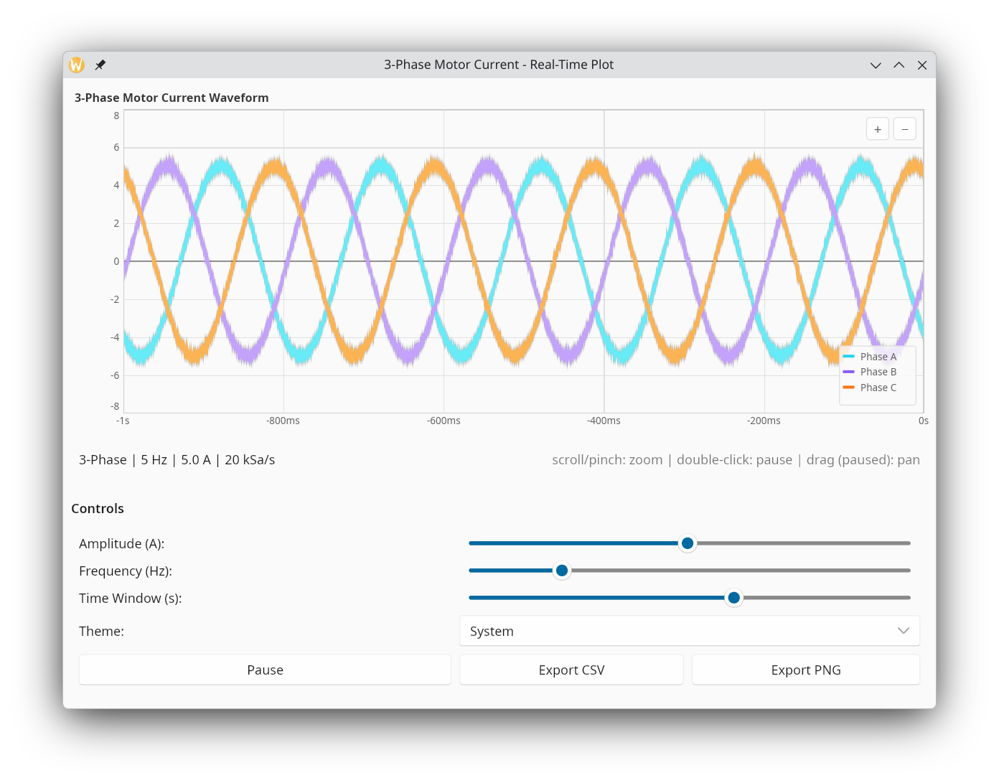

# Real-Time Plotting with Slint + WGPU

A reference implementation of **real-time waveform plotting** in [Slint](https://slint.dev/) using custom **WGPU shaders** — something not covered by existing Slint examples or third-party projects.

The demo simulates a 3-phase AC motor current sensor and renders waveforms entirely on the GPU at 20 kHz sample rate. It runs on desktop (Linux, Windows, macOS) and Android.



## Why This Project

Slint doesn't ship with a real-time plotting widget. If you need to visualize streaming data — sensor readings, audio, telemetry — you have to build the rendering yourself. This project shows one way to do it: bypass Slint's drawing primitives, render the plot as a GPU texture via WGPU, and composite it back into the Slint scene.

Key techniques demonstrated:

- **Slint ↔ WGPU integration** — using `set_rendering_notifier` to hook into Slint's render loop and produce a custom texture each frame
- **WGSL fragment shader for waveforms** — a single fullscreen-triangle pass that reads from a storage buffer and draws anti-aliased, color-coded, multi-channel signals
- **Hybrid line / peak-detect rendering** — zoomed in (≤ 8 samples per logical pixel) the shader connects consecutive samples with anti-aliased line segments; zoomed out it computes the min/max envelope per pixel column and draws vertical bars — this is how oscilloscopes handle zoomed-out views without aliasing
- **GPU immediates** (`var<immediate>`) — plot parameters (write position, Y-axis range, visible samples, view offset, hidpi scale) are passed as push constants, avoiding extra buffer allocations
- **Lock-free SPSC ring buffer** — 32,768 interleaved samples generated on a dedicated thread and shared with the render loop through atomics, no locks
- **Render caching** — a generation counter on the buffer lets the renderer skip the CPU→GPU upload and the render pass entirely when nothing changed (e.g. while paused)

## The Shader

The core of the project is `slint-realtime-plot/src/shader.wgsl`. It implements:

1. **Fullscreen triangle** vertex shader (3 vertices, no vertex buffer)
2. **Line mode** — per-pixel distance to the nearest waveform segment, anti-aliased with `smoothstep`, hidpi-aware line width
3. **Peak-detect mode** — min/max envelope per pixel column when many samples map to one pixel
4. **Ring-buffer indexing** — modular arithmetic over `write_pos`, `visible_samples`, and `view_offset` (pan)
5. **Per-channel colors** from a uniform buffer (configured on the Rust side, matches the UI legend)
6. **NaN-transparent** — unwritten buffer slots hold NaN and render as transparent, so a partially filled buffer has no artificial baseline

The shader reads samples from a `storage` buffer and all parameters via `immediate` constants.

## Features

- **20 kHz sample rate**, 32,768-sample lock-free ring buffer (3 channels interleaved), generated on a background thread
- **Interactive controls** — amplitude (0.1–10 A), frequency (1–20 Hz, phase-continuous changes), time window (0.1–1.6 s)
- **Pan & zoom** — scroll wheel and pinch gesture zoom toward the cursor, drag to pan through history while paused, on-plot +/− buttons for touch
- **Pause** via button or double-click, with paused-state border highlight
- **Auto-ranging Y axis** — follows the visible data (expands instantly, shrinks smoothly) and snaps to nice 1-2-5 grid steps
- **Cursor readout** — hover shows a measurement line with per-channel values and the time offset
- **CSV / PNG export** of the visible window
- **Dark / Light / System theme** with glow effects
- **Hidpi-aware** — the texture is rendered at physical resolution, and line widths/mode switching account for the scale factor
- **Android support** with safe area insets for notches and system bars

## Performance

Measured on Linux/Wayland (Intel Xe, release build), the plot itself is cheap:
`PlotRenderer::render()` — ring upload, auto-range scan, and the GPU pass —
takes **~0.4 ms** per frame, and the 20 kSa/s generator thread is negligible.
The app holds a steady 60 fps at **~12% of one core** while live, and drops to
**~0%** when paused.

Two profiling findings worth knowing if you build something similar:

- **Skia vs FemtoVG.** The Slint renderer choice dominates the frame budget.
  With `slint/renderer-femtovg-wgpu`, repainting this scene (plot texture +
  axis labels + controls) cost **~87% of a core** with frame-time spikes of
  25–34 ms (missed vsync). Switching to `slint/renderer-skia` renders the
  identical scene at **~12%** with a stable ~17 ms frame — roughly **7× less
  CPU**. The demo therefore uses Skia on desktop; both work with the WGPU
  texture integration.
- **Redraw on demand.** An unconditional `request_redraw()` forces Slint to
  repaint the whole scene every frame even when nothing changed.
  `RenderOutput::rendered` reports whether the renderer actually produced a
  new texture; the demo only pushes properties and schedules the next frame
  when it did, so a paused, settled plot stops redrawing entirely — input and
  property changes restart the loop on their own.

Per-second frame statistics (fps, frame-time max, `render()` cost) are printed
with `PLOT_STATS=1 cargo run --release`.

## Building

### Prerequisites

- [Rust](https://rustup.rs/) (edition 2024)
- GPU with Vulkan, Metal, or DX12 support

### Desktop

```bash
cargo run --release
```

### Android

Android builds use [xbuild](https://github.com/rust-mobile/xbuild) as recommended by the [Slint Android docs](https://docs.slint.dev/latest/docs/slint/guide/platforms/mobile/android/).

1. Install prerequisites:

   - [Android Studio](https://developer.android.com/studio) — install the Android SDK via its SDK Manager
   - Add `$ANDROID_HOME/platform-tools` to your `PATH` (for `adb`)
   - Install the Rust Android target and xbuild:

```bash
rustup target add aarch64-linux-android
cargo install --git https://github.com/rust-mobile/xbuild.git
```

2. Set environment variables (adjust paths for your system):

```bash
export ANDROID_HOME="$HOME/Android/Sdk"
export ANDROID_NDK_ROOT="$ANDROID_HOME/ndk/<version>"
```

3. Build and run on a connected device (from the `demo/` directory):

```bash
cd demo
x run --device adb:<device-id> --no-default-features --features android
```

4. Build a release APK for distribution:

```bash
cd demo
x build --platform android --arch arm64 --format apk --release --no-default-features --features android
```

The output APK will be in `target/x/release/android/`.

Alternatively, [cargo-apk2](https://crates.io/crates/cargo-apk2) (the maintained
fork of cargo-apk, which the [`slint::android` docs](https://docs.slint.dev/latest/docs/rust/slint/android/)
suggest) works too — the `[package.metadata.android]` section in
`demo/Cargo.toml` is already set up for it:

```bash
cargo install cargo-apk2
cd demo
CARGO_APK_RELEASE_KEYSTORE=$HOME/.android/debug.keystore \
CARGO_APK_RELEASE_KEYSTORE_PASSWORD=android \
cargo apk2 build --release --lib --no-default-features --features android
```

The signed APK lands in `target/release/apk/`. Point the keystore variables at
a real release key for anything beyond sideloading.

## Project Structure

The workspace is split into a reusable library crate and the demo application:

```
slint-realtime-plot/    # the reusable plotting library
  src/
    shader.wgsl         # WGSL vertex + fragment shader (line + peak-detect modes)
    renderer.rs         # WGPU pipeline, render caching, auto-range, PNG export
    buffer.rs           # Lock-free SPSC ring buffer shared between threads
    lib.rs              # Public API: PlotBuffer, PlotRenderer, required_wgpu_settings
  ui/
    plot.slint          # PlotWidget: grid, axes, legend, pan/zoom, cursor
demo/                   # the 3-phase motor demo app
  src/
    data_gen.rs         # 3-phase motor simulator (runs on its own thread)
    lib.rs              # App init, WGPU device config, render loop, exports
    main.rs             # Desktop entry point
  ui/
    scene.slint         # App layout: plot + controls
  build.rs              # Maps the @slint-realtime-plot import prefix
```

## Using the Library in Your Own Project

Add `slint-realtime-plot` as a path/git dependency, then map its `.slint` side
in your `build.rs` via `with_library_paths` (see `demo/build.rs`) and import
the widget with:

```slint
import { PlotWidget } from "@slint-realtime-plot/plot.slint";
```

On the Rust side, configure the backend with `required_wgpu_settings()`, push
samples into a `PlotBuffer` from any thread, and drive a `PlotRenderer` from
Slint's rendering notifier (see `demo/src/lib.rs` for the full wiring).

Once Slint's experimental [library modules](https://snapshots.slint.dev/master/docs/slint/guide/experimental/library-modules/)
stabilise, the `build.rs` mapping will no longer be needed — the import will
resolve automatically through Cargo metadata.

## Dependencies

| Crate | Purpose |
|-------|---------|
| [slint](https://slint.dev/) (git, `unstable-wgpu-30`) | UI framework with WGPU texture integration |
| [wgpu](https://wgpu.rs/) 30 | Cross-platform GPU API |
| [bytemuck](https://docs.rs/bytemuck) | Safe transmute for GPU data upload |
| [png](https://docs.rs/png) | PNG encoding for plot export |

## License

This project is licensed under the [MIT License](LICENSE).
